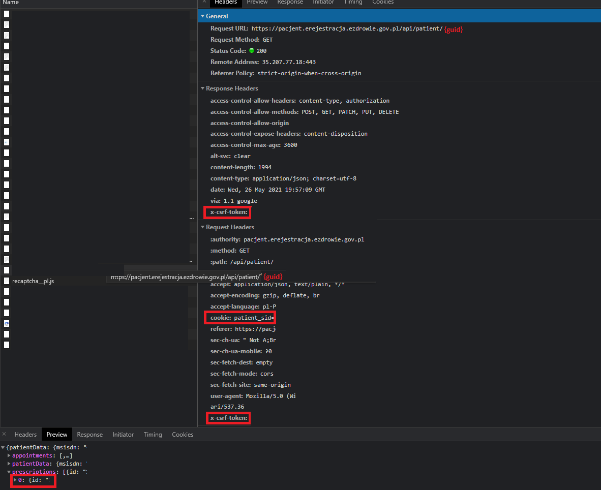

# eRejestracjaCovid19
Prosty program do szukania wolnych slotów na szczepienie Covid 19

1. Zaloguj się na stronie https://pacjent.erejestracja.ezdrowie.gov.pl/ i znajdz request "https://pacjent.erejestracja.ezdrowie.gov.pl/api/patient/{guid}"
2. Skopiuj do settings.json:  
  -patient_sid  
  -x-csrf-token
3. Skopiuj do find.json i confirm.json  
  -prescriptionId
  

  
4. Ustaw w settings.josn miasto oraz odpowiednie dla niego voiId w find.json
5. Zbuduj i uruchom program
